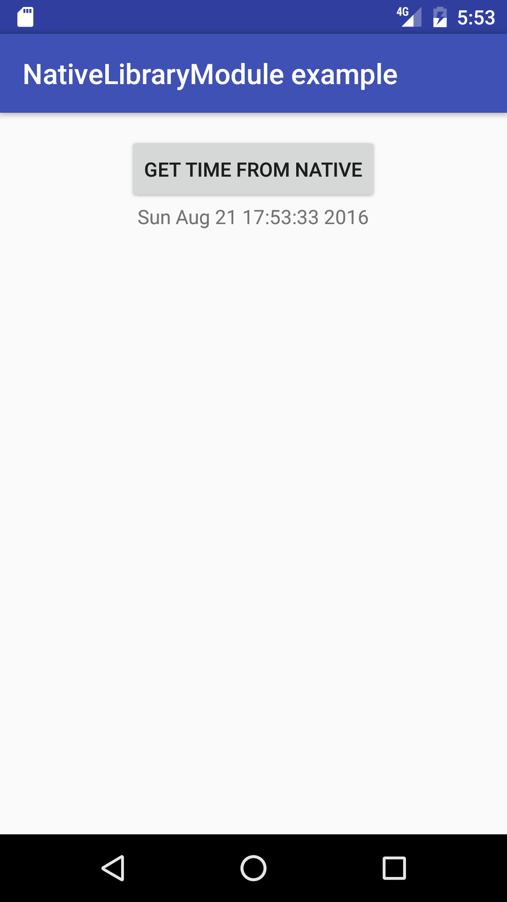

# AndroidNativeLibrary
Simple example of how create an Android module-library to hold you native code (and debug it)

For a slightly longer explanation of the example, please check [http://www.akaita.com/post/android-native-library-module-debug/](http://www.akaita.com/post/android-native-library-module-debug/ "http://www.akaita.com/post/android-native-library-module-debug/")

# Architecture #

Mixed stable and experimental Android gradle plugins:

- The main module is powered by the stable gradle plugin  
- Another module is powered by the experimental version of the gradle plugin. This module houses Native C++ code

Made the library module with C++ debuggable

# Functionality #

The main goal is to show how to isolate the C++ native code in a module build with an experimental gradle version. Importantly, it also shows how to make the library module debuggable (by default, Android doesn't allow it to be debugged).  

As for the offered User Experience,it is the most simple one I could come out with:

- a button invokes C++ code
- C++ gets the current time
- the time is shown in the screen

Of course, everything well layered and connected through JNI.

